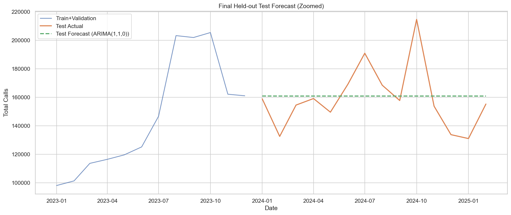

# Forecasting Healthcare Call Demand Across the COVID-Era Structural Break: Evidence from Bangladesh Health Portal Call Data

<a target="_blank" href="https://cookiecutter-data-science.drivendata.org/">
    
</a>

## Overview

This project develops break-aware time-series forecasting models to predict healthcare call demand using monthly call volume data from Bangladesh’s national health portal.

The analysis focuses on the COVID-19 structural break, which disrupted historical patterns and reduced the effectiveness of traditional seasonal forecasting methods.

---

## Problem Statement

Accurately forecasting healthcare call demand is important for:

- Staffing and resource allocation
- Emergency response planning
- Maintaining healthcare service accessibility

However, the COVID-19 pandemic introduced a major structural break, making traditional forecasting approaches less reliable.

---

## Data Sources

### Healthcare Call Data (Bangladesh Health Portal)
Directorate General of Health Services (DGHS), Government of Bangladesh  
http://16263.dghs.gov.bd/report/report.php  
(Accessed: March 18, 2025)

### Kaggle Dataset (Curated Version)
Basak, S. (2025). *Healthcare Call Data Analysis During Emergency Times*  
https://www.kaggle.com/datasets/shuvokumarbasak2030/healthcare-call-data-analysis-duringemergencytimes/data

---

## Approach

The project compares multiple time-series forecasting approaches using monthly healthcare call volume data spanning pre- and post-COVID periods.

### Models Evaluated
- Seasonal Naive baseline
- ETS (Holt-Winters Exponential Smoothing)
- ARIMA models

### Feature Engineering
- Log transformation of call volume
- COVID-period structural break indicator
- Cyclical month encoding for seasonality

### Evaluation Strategy
Models were evaluated using expanding-window time-series validation and compared using:
- MAE
- RMSE
- MAPE
- SMAPE

---

## Key Results

### Best Model
**ARIMA(1,1,0)**

### Test Performance
- **MAE:** 15,871
- **RMSE:** 21,737
- **MAPE:** **9.92%**

### Baseline Comparison
- Seasonal Naive: ~74% MAPE
- ETS: ~76% MAPE

The ARIMA model reduced forecasting error by over 7× compared to seasonal baselines, highlighting the importance of modeling structural breaks rather than relying on stable seasonal patterns.

---

## Forecast Visualization



The ARIMA model substantially outperformed simpler baselines, indicating that short-term dynamics and structural changes dominated over stable seasonal patterns.

---

## Key Findings

- Models relying primarily on year-over-year seasonality performed poorly after the COVID-era disruption.
- A log-transformed ARIMA model achieved strong forecasting performance with approximately 10% error.
- Forecast behavior suggests relatively stable post-COVID dynamics with limited predictable seasonal structure.

---

## Recommendations

1. Use ARIMA-based forecasting for short-term staffing and healthcare resource planning.
2. Avoid relying exclusively on historical seasonal patterns during or after major disruptions.
3. Monitor for future structural breaks and retrain forecasting models regularly to maintain performance.

---

## Future Work

- Incorporate external signals such as disease outbreaks or policy changes
- Explore multivariate and machine learning-based forecasting models
- Evaluate model performance using higher-frequency (weekly or daily) data

---

## Project Organization

```
├── LICENSE            <- Open-source license if one is chosen
├── README.md          <- The top-level README for developers using this project.
├── data
│   ├── processed      <- The final, canonical data sets for modeling.
│   └── raw            <- The original, immutable data dump.
│
├── models             <- Trained and serialized models, model predictions, or model summaries
│
├── notebooks          <- Jupyter notebooks. Naming convention is a number (for ordering),
│                         the creator's initials, and a short `-` delimited description, e.g.
│                         `1.0-jqp-initial-data-exploration`.
│
├── pyproject.toml     <- Project configuration file with package metadata for 
│                         healthcare_demand and configuration for tools like black
├── references         <- Data dictionaries, manuals, and all other explanatory materials.
│
├── reports            <- Generated analysis as HTML, PDF, LaTeX, etc.
│   └── figures        <- Generated graphics and figures to be used in reporting
│
└──requirements.txt   <- The requirements file for reproducing the analysis environment, e.g.
                         generated with `pip freeze > requirements.txt`
```

--------

